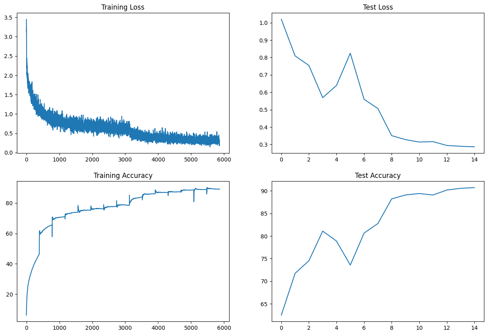
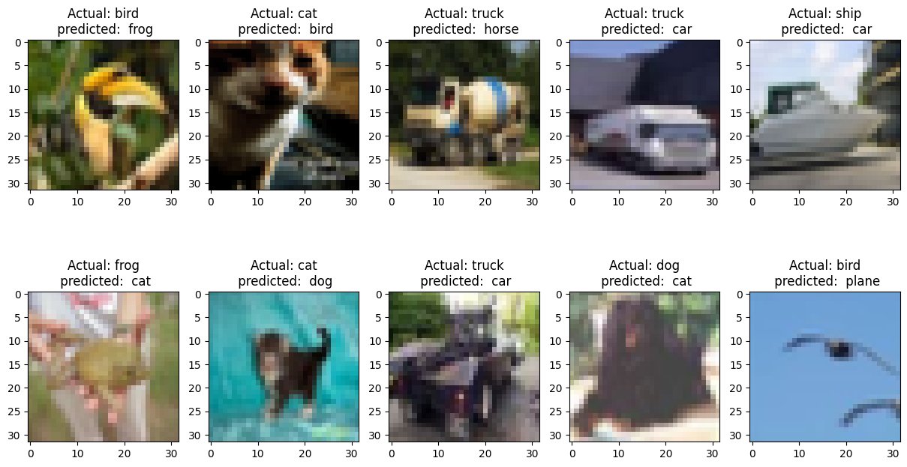

<h3><b> Session 10 </h3>
    
<h3><i><b>Residual Connections in CNNs and One Cycle Policy! </b></i></h2>

---

**Target:**

        Write a custom Links to an external site. ResNet architecture for CIFAR10 that has the following architecture:

        PrepLayer - Conv 3x3 s1, p1) >> BN >> RELU [64k]
        Layer1 -
            X = Conv 3x3 (s1, p1) >> MaxPool2D >> BN >> RELU [128k]
            R1 = ResBlock( (Conv-BN-ReLU-Conv-BN-ReLU))(X) [128k] 
            Add(X, R1)
        Layer 2 -
            Conv 3x3 [256k]
            MaxPooling2D
            BN
            ReLU
        Layer 3 -
            X = Conv 3x3 (s1, p1) >> MaxPool2D >> BN >> RELU [512k]
            R2 = ResBlock( (Conv-BN-ReLU-Conv-BN-ReLU))(X) [512k]
            Add(X, R2)
        MaxPooling with Kernel Size 4
        FC Layer 
        SoftMax
        
        Uses One Cycle Policy such that:
            Total Epochs = 24
            Max at Epoch = 5
            LRMIN = FIND
            LRMAX = FIND
            NO Annihilation
        Uses this transform -RandomCrop 32, 32 (after padding of 4) >> FlipLR >> Followed by CutOut(8, 8)
        Batch size = 512
        Use ADAM, and CrossEntropyLoss
        Target Accuracy: 90%

**Model details**
1. Model params - 4,065,728 
2. Optimizer - Adam with L2 regularization 
3. Variable LR - MultiStepLR
4. Epochs - 15
5. Batch Size - 128, 512(Not supported by local machine while running) 

**Results**
1. Model with Batch Norm
    - Train Accuracy - 89.19%
    - Test Accuracy - 90.72%
    - Accuracy/Loss plot - 
    - Misclassifications plot - 

---
