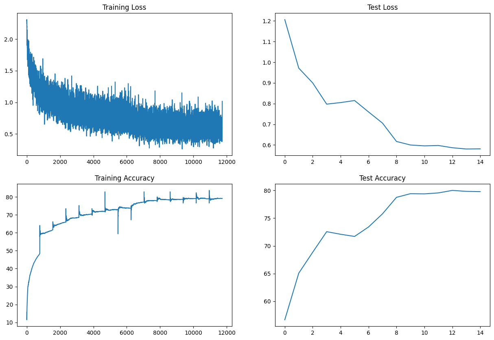
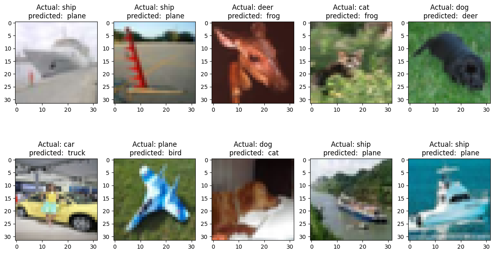
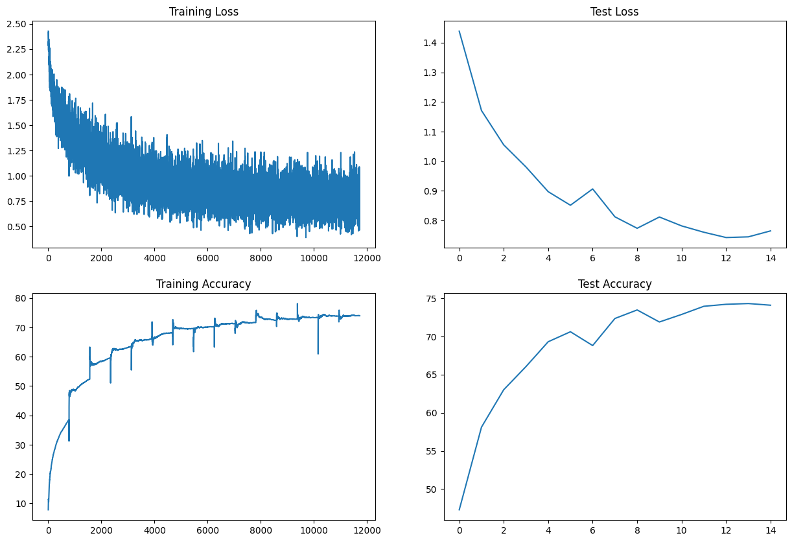
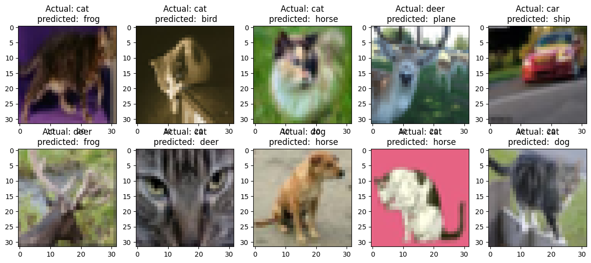

<h3><b> Session 8 </h3>

<h3><i><b>Normalization and Regularization</b></i></h2>

---

**Target:**
1. Change the dataset to CIFAR10
2. Make this network:
    -   C1 C2 c3 P1 C3 C4 C5 c6 P2 C7 C8 C9 GAP C10
    -   Keep the parameter count less than 50000
    -   Try and add one layer to another
    -   Max Epochs is 20

3. You are making 3 versions of the above code (in each case achieve above 70% accuracy):
    -    Network with Group Normalization
    -    Network with Layer Normalization (To be implemeneted)
    -    Network with Batch Normalization

**Model details**
1. Model params - 38568 
2. Optimizer - SGD with L2 regularization 
3. Variable LR - StepLR
4. Epochs - 15
5. Batch Size - 64 

**Results**
1. Model with Batch Norm
    - Train Accuracy - 79.12%
    - Test Accuracy - 79.78%
    - Accuracy/Loss plot - 
    - Misclassifications plot - 

2. Model with Group Norm
    - Train Accuracy - 73.97%
    - Test Accuracy - 74.33%
    - Accuracy/Loss plot - 
    - Misclassifications plot - 

---
